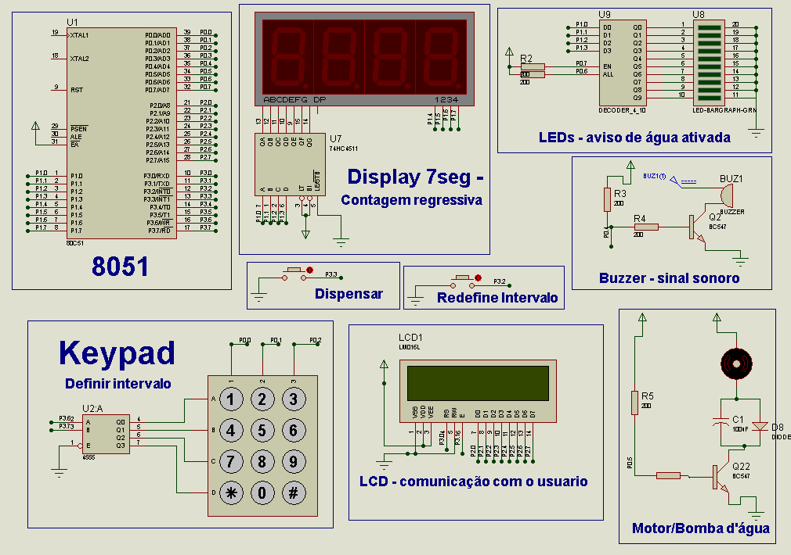
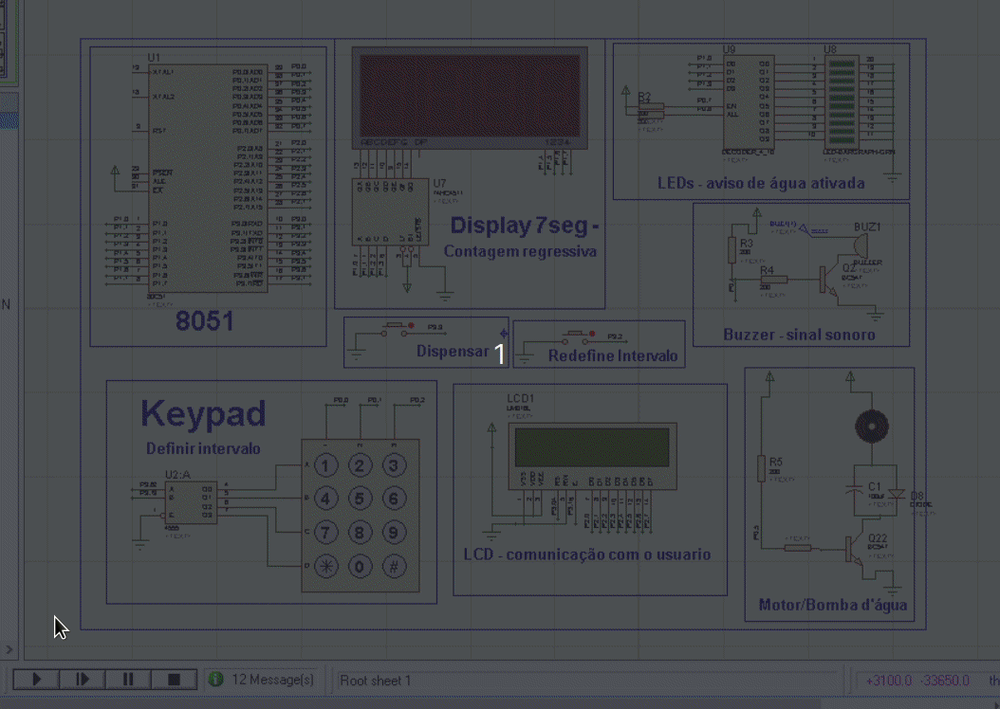

# 👩‍💻 Trabalho-Final-Microcontroladores

## O que é este projeto?

Este é o trabalho final da disciplina de Microcontroladores ofertada em 2021/1 (semestre remoto) no curso de Engenharia de computação da Universidade Federal de Pelotas.
A proposta a ser desenvolvida neste projeto é um sistema que dispensa água em intervalos definidos pelo usuário, ou de acordo com o aperto de um botão utilizando o microcontrolador 8051.

## Instruções de utilização
Para utilizar este projeto, é preciso ter o simulador ISIS Proteus instalado na sua máquina. O software Keil utilizado para fazer a programação do microcontrolador não é necessário caso você não queira modificar o código. 

O código que roda no microcontrolador é um código hexadecimal gerado a partir do programa em C desenvolvido com o Keil, e esse arquivo já se encontra disponível na pasta **Objects** com o nome de **trabalhoFinalLeticia.hex**, e já está por padrão carregado na placa de desenvolvimento presente no arquivo **trabalhoFinal.DSN** de modo que para utilizar a aplicação, basta abrir a placa no simulador e apertar o botão de play. É importante lembrar aqui que como o arquivo hexadecimal está carregado na placa a partir de um caminho relativo, cado você mude o arquivo que contém a placa de lugar, precisará regarregar o arquivo hexadecimal no microcontrolador.

Uma vez que você tenha aberto a placa, e clicado em play, o código começará a rodar, e a partir dai você pode inderir o intervalo de segundos em que quer que a água seja dispensada e então basta esperar pelo aviso do soundbuzzer indicando que a água começou a ser dispensada (bipe curto), ou parou de ser dispensada (bipe longo).

A qualquer momento durante a execução do código, você pode apertar o botão ligado à porta P3.3, que dispensará água imediatamente ou então o botão ligado à porta P3.2, que irá permitir que você redefina o intervalo entre as hidratações.

## Como este projeto funciona?

Ao iniciar a execução do projeto, o display exibe uma mensagem perguntando ao usuário qual o intervalo entre as hidratações, e então é esperado que o usuário digite um valor válido de segundos no keypad, apertando depois disso a tecla * ou # do keypad para finalizar o input. Caso o usuário digite um valor muito alto ou muito baixo, esse valor é trocado para um valor válido antes do início da contagem regressiva. 

Feito isso, a contagem é iniciada utilizando o timer1 do microcontrolador. Esse timer é setado para cronometrar 50ms, e uma vez que haja o estouro deste contador, ou seja, 50ms se passaram a interrupção de estouro do timer1 acontece e chama uma função que "anota" que 50ms se passaram. Para isso, é utilizada uma variável global que vai guardar um valor correspondente à quantos 50ms se passaram,e uma vez que tenham de passado 50ms 200 vezes, ou seja, se passou um segundo, uma segunda variável que contém a quantidade de tempo até o próximo dispenser de água é decrementada.

O tempo restante até o próximo dispenser de água é mostrado em um display de 7 segmentos de quatro dígitos e é constantemente atualizado com o valor da variável global que guarda a quantidade de tempo até o próximo dispenser de modo que a contagem regressiva aconteça corretamente.

Quando a variável que guarda o tempo até a próxima hidratação chega ao valor zero, a função de ativar água é ativada, fazendo com que aconteça o dispenser de água por um tempo determinado. No dispenser de água, contecem algumas coisas, sendo a primeira delas uma mensagem no display LCD e um bipe curto emitido pelo soundbuzzer inidicando que á água começou a ser dispensada, ou seja, a bomba (ou o motor no caso da placa de desenvolvimento) está funcionando. Essa "bomba" fica ligada por uma quantidade de tempo X, tempo no qual a barra de LEDs é ativada mostrando um efeito luminoso, e então é desligada ao que se segue uma mensagem de que a água está pronta e um outro aviso do buzzer (bipe longo).

Esse é o funcionamento básico da aplicação, mas existem ainda duas funcionalidades geradas pelas interrupções externas 0 e 1 do microcontrolador. Estas interrupções estão representadas na placa de desenvolvimento através de botões, e pressionando o botão referente à interrupção externa 0, é possível redefinir o intervalo entre as hidratações e apertando o botão referente à interrupção externa 1 é possível habilitar o dispenser imediato de água, ao qual se segue um resete da contagem regressiva

[Clique aqui para ver o vídeo com a apresentação reserva do trabalho.](https://youtu.be/XvAyQBDxBU4)

## Como este projeto está estruturado?

Como o projeto trabalha com vários componentes de hardware diferentes, e muitos com funcionalidades muito específicas, acabei dividindo a aplicação em várias "libs", sendo cada lib responsável por um tipo de componente, e contendo as funcionalidades e defines específicos para aquele componente.

* lib_7seg : display de 7 segmentos de 4 dígitos;
* lib_ativaAgua : componentes e funcionalidades necessárias para ativar o dispenser de água;
* lib_keypad : leitura do keypad e interpretação dessa leitura;
* lib_lcd : funcionalidades referentes ao display de LCD
* lib_timers : funções de delay e pooling envolvendo os timers do microcontrolador

Todas essas libs são incluidas diretamente no arquivo principal da aplicação que é o arquivo leticia_TF.c. Neste arquivo, ainda existem algumas funções implementadas que são funções relacionadas aos aspectos funcionais da aplicação em si, e não dos componentes que a compõem. 

## Recursos de Software utilizados no projeto

* [Keil uVision](https://www.keil.com/c51/demo/eval/c51.htm)
* Simulador ISIS Proteus
## Recursos de Hardware utilizados no projeto

* [Microcontrolador 8051](https://pdf1.alldatasheet.com/datasheet-pdf/view/82390/ATMEL/AT89S52.html) (utilizado a disciplina);
* [Decodificador / Multiplexador CMOS 4555 1-4](https://www.ti.com/lit/ds/symlink/cd4555b.pdf?HQS=dis-mous-null-mousermode-dsf-pf-null-wwe&ts=1636865612936&ref_url=https%253A%252F%252Fbr.mouser.com%252F);
* [Display LCD 16X2 LM016L](https://www.datasheetarchive.com/pdf/download.php?id=cea14fe6a1c8d82c706c3cf01e69100cf1b7fe&type=O&term=LCD%2520LM016L%2520SPECIFICATIONS); 
* [Decodificador BCD para 4 segmentos](https://www.ti.com/lit/ds/symlink/cd74hc4511.pdf?ts=1636866635548&ref_url=https%253A%252F%252Fwww.ti.com%252Fproduct%252FCD74HC4511%253Futm_source%253Dsupplyframe%2526utm_medium%253DSEP%2526utm_campaign%253Dnot_alldatasheet%2526DCM%253Dyes%2526dclid%253DCMLsyquLl_QCFZaRlQIdyeUC0Q);
* Componentes genéricos
    * Display de 7 segmentos de quatro dígitos;
    * Bar Graph com 10 LEDs;
    * Keypad 4X3;
    * Motor para simular a bomba d'água já que o simulador não tinha esse recurso;
    * Botões;
    * Capacitor eletrolítico;
    * Diodo;
    * Resistores;
    * Transistores NPN BC547;
    * Decoder BCD 4 para 10;

## Pinos utilizados no 8051

 pino |P0 | P1 | P2 | P3
:------:|:---:|:----:|:----:|:---:
0| Coluna 1 - Keypad | A - display 7 segmentos | display LCD| en - LCD
1| Coluna 2 - Keypad | B - display 7 segmentos |display LCD| rs - LCD
2| Coluna 3 - Keypad | C - display 7 segmentos |display LCD| Interrupção de configuração
3| | D - display 7 segmentos |display LCD| Interrupção de dispenser imediato
4| Buzzer | milhar - display 7 segmentos |display LCD|
5| Bomba / motor| centena - display 7 segmentos |display LCD|
6| enable all LEDs| dezena - display 7 segmentos |display LCD| Bit A do decodificador - keypad
7| enable LEDs| unidade - display 7 segmentos |display LCD| Bit B do decodificador -keypad

